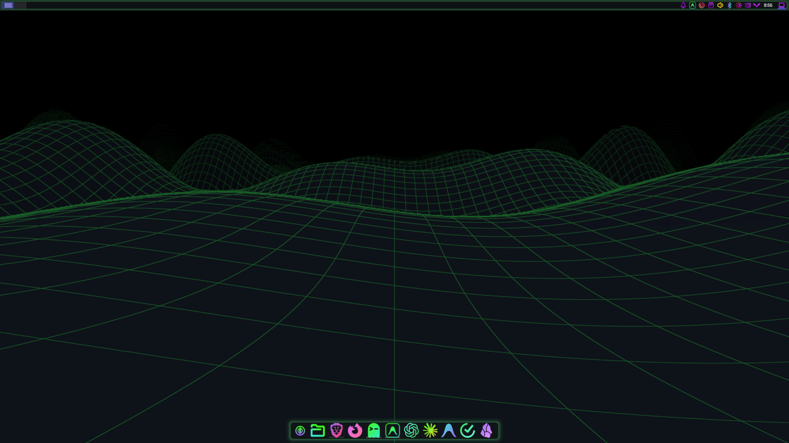
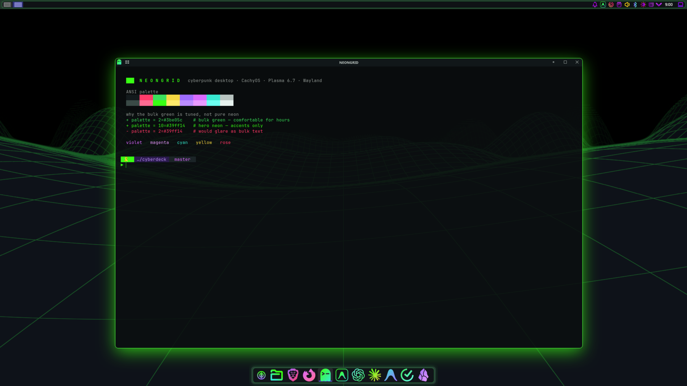

# NEONGRID

A cyberpunk desktop for a CachyOS / Plasma 6.7 Wayland box: neon green primary,
violet/magenta accents, transparency, blur, glow.

Everything derives from one file — **`palette.sh`**. Change a hex there, re-run
`./install.sh`, and it propagates to KDE, GTK, Ghostty, btop, fzf, starship,
Plymouth and the Limine boot menu.



A live GLSL wireframe wallpaper, a translucent panel with a thin neon edge and a
soft green bloom, and a dock whose icons are real brand marks recoloured into the
palette.



Ghostty over the wallpaper: real compositor blur, a green glow shadow on the
focused window (Klassy), and the tuned ANSI palette. Note the diff colours — the
**bulk** green is `#3be05c`, not `#39ff14`. Pure neon green is what paints every
diff-add line and string literal, and at that saturation it glares over a long
session, so the hero neon is reserved for accents (cursor, prompt, borders, glow).


Icons are the part that usually breaks a theme: every icon set keeps each app's
**brand hue**, so a dock ends up a rainbow. Flattening them all to one colour is
the other trap — it looks sterile and kills the neon. Instead, every icon in the
theme is **hue-snapped** into the palette (HSL: hue → nearest palette hue,
saturation up, *lightness and gradients preserved*), and the dock apps get real
vector brand marks, each with its own two-stop neon gradient.

## Install on a new machine

```
git clone https://github.com/cromewar/neongrid.git ~/cyberdeck && cd ~/cyberdeck
./bootstrap.sh --dry-run    # show every action, change nothing
./bootstrap.sh              # ONE password prompt, then hands-off
```

`bootstrap.sh` is the full build: packages, icon theme, cursor, shader wallpaper,
KDE, GTK, Ghostty, shell, boot splash, bootloader and login screen. It asks for
your password **exactly once** (`sudo -v` + keepalive), and adapts to the machine
— Limine/Plymouth/plasmalogin steps are skipped if absent.

Tested on CachyOS + Plasma 6.7.2 + Wayland. It should work on any Arch-based
Plasma 6 Wayland system; Limine / Plymouth / plasmalogin steps self-skip if the
machine doesn't have them.

## Iterating afterwards

```
./install.sh                # re-apply everything user-level
./install.sh --only ghostty # one layer: kde|gtk|ghostty|shell|panel|cursor|boot
./install.sh --root         # the privileged pass (cursor, greeter, boot)
```

## The palette

| role | hex | why |
|---|---|---|
| `BG` | `#0a0e0f` | near-black, faint cyan cast. **Not** `#000000` — ANSI black must stay distinguishable from the background or btop/fzf lose their block edges. |
| `FG` | `#c6d0cb` | neutral grey-green, **deliberately not green**. Green-on-black *everything* is the classic "matrix theme" mistake and makes Claude Code diffs illegible. |
| `GREEN` | `#3be05c` | **bulk** ANSI green: diff-adds, strings, success. ~11:1 contrast — comfortable for hours. |
| `GREEN_HERO` | `#39ff14` | accents only: cursor, prompt, focus rings, borders, glow. |
| `VIOLET` | `#9d6bff` | accent, and the ANSI **blue** slot (see caveat). |
| `MAGENTA` | `#d96bff` | secondary accent, hover. |

### Two deliberate tradeoffs

1. **`#39ff14` is not the bulk green.** ANSI green paints large blocks of text.
   Pure `#39ff14` on black is maximally saturated at the eye's peak sensitivity
   and produces glare over long sessions — no shipping theme uses it there
   (Dracula `#50fa7b`, Blue Matrix `#00ff9c`, Aura `#61ffca`). It is reserved
   for small accents where it pops.
2. **ANSI slot 4 (blue) is remapped to violet.** This is what makes the terminal
   read cyberpunk, but it *is* a semantic change — some tools assume blue means
   blue. If something looks wrong, this is why.

## What each layer is, and why

| layer | tool | note |
|---|---|---|
| Colors | `kde/NeonGrid.colors` | The keystone. Darkly + Kirigami + `kde-gtk-config` all read it, so one file colors every Qt app, System Settings **and** GTK3. |
| App style | **Darkly** | Chosen over Kvantum because it *follows the color scheme* — no SVG editing — and Kvantum cannot theme QML/Kirigami at all. |
| Decoration | **Klassy** | The only decoration with a configurable accent-colored window outline + colored shadow. |
| Blur/glow | **Better Blur DX** | `kwin-effects-forceblur` is **archived and gone from the AUR** — this is its live successor. Force-blurs by window class, which is the *only* way to blur apps that never request it. |
| Panel | **Panel Colorizer** | The single biggest visual lever: translucent floating slab, neon border, green glow, violet widget islands. |
| Wallpaper | **kde-shader-wallpaper** | Live GLSL. Also drives the **login screen** (see below). |
| GTK4 | hand-written `gtk-4.0/gtk.css` | **Gradience is archived.** libadwaita has no theme API; KDE's accent portal + `@define-color` is the 2026 way. |

### Ghostty: blur is compositor-side on purpose

Ghostty's own `background-blur` **silently does nothing here**. KDE 6.7 dropped the
old `org_kde_kwin_blur_manager` protocol for the standardized
`ext-background-effect-v1`, and Ghostty 1.3.1 only speaks the old one (fixed in
`main`, not in the release — the same break hit kitty). We get blur anyway by
force-blurring Ghostty's window class in Better Blur DX, which is strictly better:
it fixes every other app too. No need for `ghostty-git`.

Config lives at `~/.config/ghostty/config.ghostty` — that filename **is** valid
(the extension exists so editors can syntax-highlight it). Do not also create `config`.

### Login screen

`plasmalogin` cannot use QML themes at all — verified against the installed
binaries, its **only** appearance hook is `WallpaperPluginId`. The global
look-and-feel package does *not* theme it. But that one key accepts any Plasma
wallpaper plugin, so we point it at the shader wallpaper and get an **animated
neon greeter — something SDDM structurally cannot do.**

## ⚠ After every Plasma update

Three components are compiled against Plasma/KWin internals:

| component | what breaks if not rebuilt |
|---|---|
| `kwin-effects-better-blur-dx` | blur silently stops |
| `klassy-git` | windows lose decorations |
| `plasma6-applets-panel-colorizer` | **plasmashell can crash-loop** |

A pacman hook warns you. Then run:

```
~/cyberdeck/rebuild.sh
```

### If plasmashell is crash-looping

Panel Colorizer's C++ plugin is the usual culprit:

```
rm -rf ~/.local/share/plasma/plasmoids/luisbocanegra.panel.colorizer
systemctl --user restart plasma-plasmashell.service
```

### If the machine will not boot

`install-root.sh` backs up the bootloader config before touching it:

```
cp /boot/limine.conf.neongrid-backup /boot/limine.conf
```

Every `pacman`/`paru` run also takes a snapper snapshot, and `limine-snapper-sync`
exposes them in the boot menu — so you can always boot a pre-NeonGrid snapshot.

## Gotchas worth remembering

- **"Accent color from wallpaper" must stay OFF** (`install.sh` disables it). With
  an animated wallpaper it would otherwise overwrite the neon accent continuously.
- **Background Contrast is disabled on purpose.** It lightens whatever is behind a
  translucent window and washes out a near-black base. Tune contrast inside
  Better Blur instead.
- **Klassy reads its config only when KWin starts.** Changes to `klassy/klassyrc`
  do not appear on `kwin reconfigure` — log out and back in.
- **Cursor themes go in `/usr/share/icons`**, not `~/.local/share/icons` — some
  Wayland/GTK clients cannot see the user dir.
- The shader wallpaper is capped to 30 FPS and pauses on maximize: the same iGPU
  serves your local models, and an uncapped shader is a real, continuous cost.
- **Orbitron is never the UI font** — it is genuinely unreadable at UI sizes. UI is
  Rajdhani; Orbitron is for headings/splash only.
